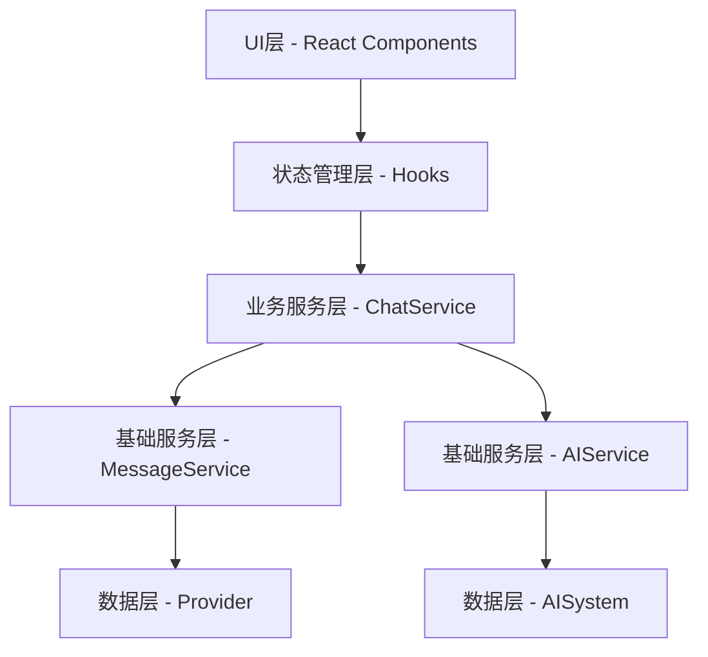
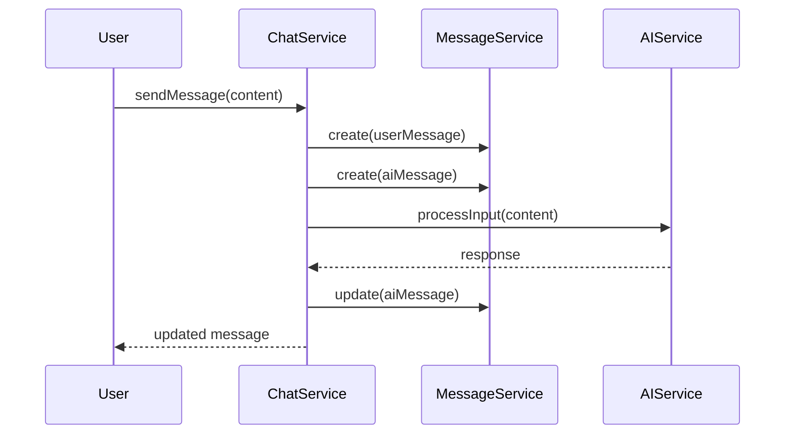

# Chat 功能设计文档

## 架构设计



## 数据模型

### Message
```typescript
interface Message {
  id: string;
  content: string;
  role: 'user' | 'assistant' | 'system';
  status: 'sending' | 'sent' | 'error';
  timestamp: number;
  conversationId: string;
  parentMessageId?: string;  // 消息关联
  metadata?: {
    tokens?: number;
    model?: string;
    plugins?: string[];
  };
}
```

## 服务设计

### ChatService
负责协调消息服务和 AI 服务，处理消息的发送和接收流程。

```typescript
class ChatService {
  constructor(
    private messageService: MessageService,
    private aiService: AISystem
  ) {}

  async sendMessage(content: string, conversationId: string) {
    // 1. 创建用户消息
    // 2. 创建AI响应消息占位
    // 3. 调用AI服务
    // 4. 更新AI消息
  }
}
```

### AIService
基于 AgentKai 的 AI 服务实现，提供智能对话能力。

```typescript
// 配置
const config: AgentKaiConfig = {
  modelConfig: {
    model: import.meta.env.AI_MODEL_NAME,
    apiKey: import.meta.env.AI_API_KEY,
    apiBaseUrl: import.meta.env.AI_BASE_URL,
    embeddingModel: import.meta.env.AI_EMBEDDING_MODEL,
    embeddingBaseUrl: import.meta.env.AI_EMBEDDING_BASE_URL,
    embeddingDimensions: 1024,
    maxTokens: 1000,
    temperature: 0.5,
  },
  memoryConfig: {
    vectorDimensions: 1024,
    maxMemories: 1000,
    similarityThreshold: 0.3,
    shortTermCapacity: 100,
    importanceThreshold: 0.5,
  },
  appConfig: {
    name: "cardos",
    version: "1.0.0",
    defaultLanguage: "zh-CN",
    dataPath: "data",
  },
};

// 初始化
export const initializeAISystem = async () => {
  const model = new OpenAIModel(config.modelConfig);
  const aiSystem = new AISystem(config, model);
  
  // 插件系统
  const goalsPlugin = new GoalsPlugin(aiSystem);
  const memoryPlugin = new MemoryPlugin(aiSystem.getMemorySystem());
  const basicToolsPlugin = new BasicToolsPlugin(aiSystem);

  const pluginManager = aiSystem["pluginManager"];
  pluginManager.addPlugin(goalsPlugin);
  pluginManager.addPlugin(memoryPlugin);
  pluginManager.addPlugin(basicToolsPlugin);

  await aiSystem.initialize();
  return aiSystem;
};

// 单例模式获取服务
export const getAIService = async () => {
  if (!aiSystem) {
    aiSystem = await initializeAISystem();
  }
  return aiSystem;
};
```

特点：
1. 基于 AgentKai 框架
2. 支持多种插件：Goals、Memory、Basic Tools
3. 单例模式确保全局唯一实例
4. 环境变量配置，便于部署
5. 支持向量记忆系统

## 交互流程



## 扩展性设计

### 插件系统
- Goals Plugin: 目标管理
- Memory Plugin: 记忆系统
- Basic Tools Plugin: 基础工具

### 待实现特性
1. 流式响应
   - 实时显示 AI 响应
   - 打字机效果
   - 支持响应中断

2. 上下文管理
   - 短期记忆
   - 长期记忆
   - 重要性判断

3. 错误处理
   - 自动重试机制
   - 降级策略
   - 用户提示

4. 性能优化
   - 消息缓存
   - 并发控制
   - 懒加载

## 后续规划

### 近期优先级
1. 基础消息收发
2. AI 服务集成
3. 错误处理
4. 流式响应

### 未来规划
1. 插件系统完善
2. 多模型支持
3. 高级上下文管理
4. 性能优化 